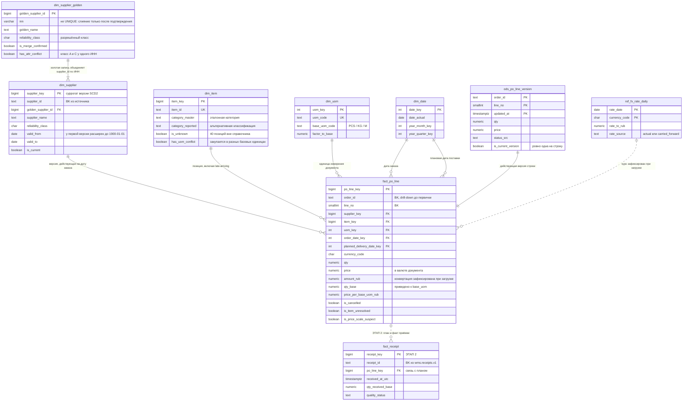

# 2. Проектирование аналитического решения

Документ опирается на три входных материала как на единый контекст: конспект стартовой встречи и scope первого релиза в [01_discovery.md](01_discovery.md), результаты профилирования в [data_defects.md](data_defects.md), исходные данные в [data/](data/).

**Обозначения по всему документу:** *Факт* — подтверждается входными материалами или проверкой на данных. *Решение* — архитектурный выбор команды. *Допущение* — то, чего во входных материалах нет и что требует подтверждения заказчиком.

---

## 2.1. Целевая модель и выбор схемы

### Архитектурный подход

Четыре слоя с разной ответственностью — механическое копирование структуры CSV в целевую модель не выполняется ни на одном из переходов:

| Слой | Что содержит | Ответственность |
|---|---|---|
| `src` | реплика 1С:УТ на чтение (в датасете — CSV) | источник, не изменяется |
| `stg` | типизация, объявление временных зон, технические поля загрузки | ничего не решает по бизнесу |
| `ods` | история версий строк заказа, разрешение актуальной версии, MDM-сопоставление поставщиков | нормализованные данные с историчностью |
| `dds` | звезда: `fact_po_line` и четыре измерения | целевая аналитическая модель |
| `mart` | три витрины под конкретные вопросы релиза | ответы на вопросы, а не «универсальный куб» |

Ключевой переход — `ods → dds`: 55 644 строки источника превращаются в 53 248 строк факта, потому что зерно целевой модели — не «строка файла», а **действующая версия строки заказа**.

### Обоснование выбора

**Решение: звезда (star schema).**

- **Объём этого не оспаривает.** 53 тыс. строк факта, 128 поставщиков, 800 позиций. Нормализация ради экономии места бессмысленна, а Data Vault или 3НФ добавили бы слой джойнов без единого выигрыша в этом масштабе и на четырёхнедельном сроке релиза.
- **Пользователи — не инженеры.** Витрину читают директор по закупкам и категорийные менеджеры, часть работы идёт в BI-инструменте. Звезда даёт предсказуемые джойны «факт → измерение по равенству суррогата» — конструкцию, в которой сложно случайно задвоить факты. Это прямое следствие цели релиза: цифре должны верить.
- **Снежинка не нужна ровно в одном месте, где её обычно делают.** Категория остаётся атрибутом `dim_item`, а не выносится в отдельную таблицу: иерархия одноуровневая (10 категорий), а её вынос усложнил бы разрез, который является центральным для Ковалёвой.
- **Единица измерения, наоборот, вынесена в самостоятельное измерение,** хотя интуитивно выглядит атрибутом товара. Причина фактическая: в 82,9% строк единица заказа не совпадает с единицей номенклатуры, то есть единица — свойство строки документа, а не позиции. Сделав её атрибутом `dim_item`, мы бы зафиксировали в модели неверное утверждение.
- **Одна фактовая таблица в первом релизе.** Все метрики релиза — оборот, цена за единицу, динамика — считаются на одном зерне. Вторая фактовая таблица (`fact_receipt`) появляется на этапе 2 и подключается к существующей звезде по `po_line_key`, не требуя переделки модели.

**Чего в модели сознательно нет:**

| Сущность | Почему отсутствует |
|---|---|
| `dim_order` (заказ как сущность) | Метрики релиза считаются на уровне строк; отдельная таблица заказов понадобилась бы для метрики «количество заказов», которая на встрече не звучала. Атрибуты шапки (тип, город, валюта) вырождены в факт. **Следствие, которое нужно проговорить:** 3 572 заказа без строк (16,8%, наблюдение из профилирования) в модель не попадают — это фиксируется DQ-метрикой, а не таблицей |
| `fact_receipt`, витрина OTIF | Этап 2 по scope. В модели предусмотрены точки подключения (`po_line_key`, `planned_delivery_date_key`, `qty_base`), реализации в DDL нет |
| Измерения под договоры, тендеры, прайсы, маркетплейсы | Соответствующие источники исключены из первых восьми недель |
| `dim_currency` | Валют три, и они участвуют только как код и курс. Отдельное измерение не даёт ни одного атрибута для анализа |

### ER-диаграмма



Диаграмма продублирована отдельным файлом [02_model_diagram.mmd](02_model_diagram.mmd). Пунктирная связь с `fact_receipt` показывает точку расширения на этап 2 — в DDL первого релиза этой таблицы нет.

---

## 2.2. Зерно таблиц и витрин

### ods.po_line_version

> **Одна строка = одна уникальная версия строки заказа поставщику: `(order_id, line_no, updated_at)`.**

Проверено на данных: 54 053 уникальных сочетания при 54 053 уникальных полных строках и нуле конфликтов, то есть после схлопывания 1 591 полного дубля ключ честный. Актуальная версия помечена `is_current_version`; частичный уникальный индекс гарантирует, что она ровно одна.

### dds.fact_po_line

> **Одна строка = действующая версия строки заказа поставщику, `(order_id, line_no)`.**

53 248 строк. Это зерно, а не «строка файла» и не «заказ»: заказ содержит от 1 до 5 строк, строка имеет от 1 до 3 версий. Меры `qty`, `amount_doc`, `amount_rub`, `qty_base` аддитивны по всем измерениям; `price` и `price_per_base_uom_rub` **не аддитивны** и агрегируются только как `SUM(amount) / SUM(qty_base)`.

### dds.dim_supplier

> **Одна строка = версия поставщика из источника, `(supplier_id, valid_from)`.**

143 строки на 128 `supplier_id`. Факт ссылается на конкретную версию суррогатом, а не на `supplier_id`.

### dds.dim_supplier_golden

> **Одна строка = юридическое лицо, признанное единым для аналитики.**

До ручного подтверждения — 128 строк (по одной на `supplier_id`), после подтверждения восьми пар — 120.

### dds.dim_item / dds.dim_uom / dds.dim_date

> `dim_item`: **одна строка = позиция номенклатуры, `item_id`** (760 из справочника + 40 late-arriving + Unknown-член).
> `dim_uom`: **одна строка = код единицы измерения, `uom_code`** (8 + Unknown-член).
> `dim_date`: **одна строка = календарный день.**

### dds.ref_fx_rate_daily

> **Одна строка = курс валюты на календарный день: `(rate_date, currency_code)`.**

Полный календарь без пропусков: 955 дней × 3 валюты (включая строку RUB = 1,0), из них 272 даты по каждой валюте — протянутые.

### mart.spend_monthly

> **Одна строка = месяц заказа × золотой поставщик × категория.**

Активные и отменённые суммы разведены по колонкам через `FILTER`, а не по строкам — иначе зерно удвоилось бы и `SUM` по витрине давал бы двойной учёт.

### mart.price_benchmark

> **Одна строка = месяц заказа × позиция × базовая единица измерения × золотой поставщик.**

Базовая единица входит в зерно намеренно: это структурная гарантия того, что цена за килограмм никогда не будет сравнена с ценой за штуку. Минимальная цена и переплата считаются оконной функцией внутри группы `(месяц, позиция, базовая единица)`.

### mart.price_dynamics_quarter

> **Одна строка = квартал × позиция × базовая единица измерения.**

Ответ на вопрос «где выросло за квартал». Свод до категории делается **не** усреднением цены (средняя цена по разнородным позициям не имеет смысла), а как число позиций с ростом выше порога и суммарное рублёвое влияние `price_change_impact_rub`.

### dq.run_metric

> **Одна строка = значение одной DQ-метрики в одной загрузке: `(load_id, layer, metric_code)`.**

### Где модель могла бы задвоить факты и что этому препятствует

Требование проверено по каждому соединению, в котором двойной учёт возникает на практике:

| Соединение | Риск | Что препятствует |
|---|---|---|
| Строки заказа × версии строк | Суммирование всех версий завышает оборот на 4,47% | Зерно факта — только действующая версия; `UNIQUE (order_id, line_no)` в факте и частичный уникальный индекс `is_current_version` в ODS. История доступна отдельно в `ods.po_line_version` |
| Строки заказа × полные дубли источника | 1 591 лишняя строка | Схлопывание при загрузке в ODS с записью счётчика в `dq.run_metric` |
| Факт × версии поставщика | Джойн по диапазону дат (`order_date BETWEEN valid_from AND valid_to`) размножает строку при пересечении периодов и теряет её при разрыве | Версия разрешается **один раз, при загрузке**; в факте лежит суррогат. В запросах — только соединение по равенству. Дополнительно: `EXCLUDE`-ограничение на пересечение периодов и расширение `valid_from` первой версии до `1900-01-01` |
| Факт × золотая запись поставщика | Соединение через таблицу сопоставления «многие ко многим» | Связь однонаправленная: `dim_supplier.golden_supplier_id` — обычный FK, одна версия принадлежит ровно одной золотой записи. Отдельной bridge-таблицы нет |
| Заказы × строки | `COUNT(*)` по факту считает строки, а не заказы | В витрине `orders_with_lines` — `COUNT(DISTINCT order_id)`, полуаддитивная мера: складывать её по строкам витрины нельзя, о чём сказано в матрице метрик |
| Строки заказа × приёмки (этап 2) | 63 691 приёмка против 53 248 строк: соединение «один ко многим» превратит одну опоздавшую строку в несколько «своевременных» событий | Зерно OTIF задаётся строкой заказа, а не приёмкой; приёмки агрегируются до строки **до** расчёта метрики. Это же — рабочая гипотеза расхождения 94% и 71% |
| Факт × справочник единиц | Строка ссылается на единицу документа, позиция — на справочную | Два разных поля: `fact.uom_key` (единица документа) и `dim_item.ref_uom_code` (справочная). Соединения между ними нет, поэтому размножения нет |

---

## 2.3. DDL целевых таблиц

PostgreSQL. DDL сокращён до того, что определяет физическую структуру: технические поля аудита загрузки, партиционирование и права опущены. Дублируется отдельным файлом [02_ddl.sql](02_ddl.sql).

```sql
-- =====================================================================
-- Целевая аналитическая модель закупок. PostgreSQL. Первый релиз.
-- Сокращённый DDL: показана физическая структура, а не production-обвязка
-- (партиционирование, права, аудит-поля загрузки опущены).
-- =====================================================================

CREATE EXTENSION IF NOT EXISTS btree_gist;   -- нужен для EXCLUDE в dim_supplier

CREATE SCHEMA IF NOT EXISTS ods;    -- нормализованный слой: версии, историчность
CREATE SCHEMA IF NOT EXISTS dds;    -- целевая аналитическая модель (звезда)
CREATE SCHEMA IF NOT EXISTS mart;   -- витрины под конкретные вопросы
CREATE SCHEMA IF NOT EXISTS dq;     -- метрики качества данных

-- ---------------------------------------------------------------------
-- ODS. История версий строк заказа.
-- Полные дубли строк (1 591 из 55 644) схлопываются на загрузке, их число
-- пишется в dq.run_metric — это и есть предусмотренный механизм обработки,
-- позволяющий держать здесь честный первичный ключ.
-- ---------------------------------------------------------------------
CREATE TABLE ods.po_line_version (
    order_id              text          NOT NULL,
    line_no               smallint      NOT NULL,
    updated_at            timestamptz   NOT NULL,   -- зона MSK объявляется при загрузке
    item_id_src           text          NOT NULL,
    qty                   numeric(18,3) NOT NULL,
    price                 numeric(18,4) NOT NULL,
    plan_price            numeric(18,4),
    uom_code_src          text          NOT NULL,
    planned_delivery_date date          NOT NULL,
    status_src            text          NOT NULL,
    is_current_version    boolean       NOT NULL,
    src_dup_cnt           smallint      NOT NULL DEFAULT 1,  -- сколько раз строка пришла из источника
    load_id               bigint        NOT NULL,
    CONSTRAINT pk_po_line_version PRIMARY KEY (order_id, line_no, updated_at),
    CONSTRAINT ck_po_line_status  CHECK (status_src IN ('active','cancelled')),
    CONSTRAINT ck_po_line_qty     CHECK (qty > 0 AND price >= 0)
);

-- Структурная защита от дефекта 1: у строки заказа ровно одна действующая версия
CREATE UNIQUE INDEX uq_po_line_current
    ON ods.po_line_version (order_id, line_no) WHERE is_current_version;

CREATE INDEX ix_po_line_version_key ON ods.po_line_version (order_id, line_no);

-- ---------------------------------------------------------------------
-- Справочник курсов. Полный календарь: выходные (272 даты) заполняются
-- протяжкой последнего known-курса с явным признаком происхождения.
-- Строка RUB = 1.0 хранится, чтобы ETL и витрины не содержали CASE по валюте.
-- ---------------------------------------------------------------------
CREATE TABLE dds.ref_fx_rate_daily (
    rate_date     date          NOT NULL,
    currency_code char(3)       NOT NULL,
    rate_to_rub   numeric(18,6) NOT NULL,
    rate_source   text          NOT NULL,
    CONSTRAINT pk_fx_rate    PRIMARY KEY (rate_date, currency_code),
    CONSTRAINT ck_fx_rate    CHECK (rate_to_rub > 0),
    CONSTRAINT ck_fx_source  CHECK (rate_source IN ('actual','carried_forward'))
);

-- ---------------------------------------------------------------------
-- Измерения
-- ---------------------------------------------------------------------
CREATE TABLE dds.dim_date (
    date_key         int     PRIMARY KEY,          -- YYYYMMDD
    date_actual      date    NOT NULL UNIQUE,
    year_month_key   int     NOT NULL,             -- YYYYMM
    year_quarter_key int     NOT NULL,             -- YYYYQ
    quarter_no       smallint NOT NULL,
    month_no         smallint NOT NULL,
    is_weekend       boolean NOT NULL
);

-- Золотая запись поставщика (MDM). UNIQUE(inn) сознательно НЕ ставится:
-- один ИНН может законно обслуживать несколько учётных записей, и до ручного
-- подтверждения каждая запись источника получает собственную золотую запись.
CREATE TABLE dds.dim_supplier_golden (
    golden_supplier_id bigint GENERATED BY DEFAULT AS IDENTITY PRIMARY KEY,
    inn                varchar(12) NOT NULL,
    golden_name        text        NOT NULL,
    region             text,
    reliability_class  char(1),
    is_merge_confirmed boolean     NOT NULL DEFAULT false,
    has_attr_conflict  boolean     NOT NULL DEFAULT false,  -- класс A и C у одного ИНН
    confirmed_by       text,
    confirmed_at       timestamptz,
    CONSTRAINT ck_golden_inn CHECK (inn ~ '^[0-9]{10}$' OR inn ~ '^[0-9]{12}$')
);
CREATE INDEX ix_golden_inn ON dds.dim_supplier_golden (inn);

-- SCD2 по версиям источника. valid_from самой ранней версии расширяется
-- до 1900-01-01, иначе 230 заказов остаются без действующей версии поставщика.
CREATE TABLE dds.dim_supplier (
    supplier_key       bigint GENERATED BY DEFAULT AS IDENTITY PRIMARY KEY,
    supplier_id        text        NOT NULL,
    golden_supplier_id bigint      NOT NULL REFERENCES dds.dim_supplier_golden,
    supplier_name      text        NOT NULL,
    supplier_name_norm text        NOT NULL,   -- TRIM + схлопывание пробелов + регистр
    inn                varchar(12) NOT NULL,
    region             text,
    reliability_class  char(1),
    valid_from         date        NOT NULL,
    valid_to           date        NOT NULL DEFAULT DATE '9999-12-31',
    is_current         boolean     NOT NULL,
    CONSTRAINT uq_supplier_version UNIQUE (supplier_id, valid_from),
    CONSTRAINT ck_supplier_period  CHECK (valid_from <= valid_to),
    -- периоды историчности одного поставщика не пересекаются (на данных нарушений нет)
    CONSTRAINT ex_supplier_overlap EXCLUDE USING gist (
        supplier_id WITH =, daterange(valid_from, valid_to, '[]') WITH &&)
);
-- не более одной актуальной версии на поставщика
CREATE UNIQUE INDEX uq_supplier_current
    ON dds.dim_supplier (supplier_id) WHERE is_current;
CREATE INDEX ix_supplier_golden ON dds.dim_supplier (golden_supplier_id);

-- Номенклатура. 40 позиций, отсутствующих в справочнике, грузятся как
-- late-arriving stub (is_unknown = true) и обогащаются на месте после догрузки
-- справочника — без перезагрузки фактов.
CREATE TABLE dds.dim_item (
    item_key              bigint GENERATED BY DEFAULT AS IDENTITY PRIMARY KEY,
    item_id               text    NOT NULL,
    item_name             text,
    category_master       text    NOT NULL DEFAULT 'Не определена',
    category_reported     text,
    has_category_conflict boolean NOT NULL DEFAULT false,   -- 33 позиции
    ref_uom_code          text,                             -- единица из справочника
    is_unknown            boolean NOT NULL DEFAULT false,
    has_uom_conflict      boolean NOT NULL DEFAULT false,   -- закупки в разных базовых единицах
    CONSTRAINT uq_item UNIQUE (item_id)
);
CREATE INDEX ix_item_category ON dds.dim_item (category_master);

CREATE TABLE dds.dim_uom (
    uom_key        int GENERATED BY DEFAULT AS IDENTITY PRIMARY KEY,
    uom_code       text          NOT NULL,
    uom_name       text,
    base_uom_code  text          NOT NULL,   -- PCS / KG / M
    factor_to_base numeric(18,6) NOT NULL,
    CONSTRAINT uq_uom       UNIQUE (uom_code),
    CONSTRAINT ck_uom_factor CHECK (factor_to_base > 0)
);

-- Unknown-члены измерений (ключ -1). IDENTITY объявлен BY DEFAULT именно
-- для того, чтобы эти строки можно было вставить с явным ключом.
INSERT INTO dds.dim_supplier_golden (golden_supplier_id, inn, golden_name)
VALUES (-1, '0000000000', 'Не определён');
INSERT INTO dds.dim_supplier (supplier_key, supplier_id, golden_supplier_id, supplier_name,
                              supplier_name_norm, inn, valid_from, valid_to, is_current)
VALUES (-1, '#UNKNOWN', -1, 'Не определён', 'не определён', '0000000000',
        DATE '1900-01-01', DATE '9999-12-31', true);
INSERT INTO dds.dim_item (item_key, item_id, item_name, is_unknown)
VALUES (-1, '#UNKNOWN', 'Не определена', true);
INSERT INTO dds.dim_uom (uom_key, uom_code, uom_name, base_uom_code, factor_to_base)
VALUES (-1, '#UNKNOWN', 'Не определена', '#UNKNOWN', 1.0);

-- ---------------------------------------------------------------------
-- Фактовая таблица первого релиза.
-- Зерно: одна действующая версия строки заказа поставщику.
-- ---------------------------------------------------------------------
CREATE TABLE dds.fact_po_line (
    po_line_key               bigint GENERATED ALWAYS AS IDENTITY PRIMARY KEY,

    -- бизнес-ключ и drill-down до первичного документа
    order_id                  text     NOT NULL,
    line_no                   smallint NOT NULL,

    -- измерения
    supplier_key              bigint   NOT NULL REFERENCES dds.dim_supplier,
    item_key                  bigint   NOT NULL REFERENCES dds.dim_item,
    uom_key                   int      NOT NULL REFERENCES dds.dim_uom,
    order_date_key            int      NOT NULL REFERENCES dds.dim_date,
    planned_delivery_date_key int      NOT NULL REFERENCES dds.dim_date,

    -- вырожденные атрибуты заказа (отдельная сущность «заказ» в scope не нужна)
    order_dttm_msk            timestamptz NOT NULL,
    order_type                text     NOT NULL,
    delivery_city             text,
    item_id_src               text     NOT NULL,   -- исходный код позиции сохраняется всегда

    -- меры в валюте документа
    currency_code             char(3)       NOT NULL,
    qty                       numeric(18,3) NOT NULL,
    price                     numeric(18,4) NOT NULL,
    plan_price                numeric(18,4),
    amount_doc                numeric(20,4) GENERATED ALWAYS AS (qty * price) STORED,

    -- нормализация валюты: курс фиксируется в строке факта
    fx_rate                   numeric(18,6) NOT NULL,
    fx_rate_date              date          NOT NULL,
    fx_rate_source            text          NOT NULL,
    amount_rub                numeric(20,4) NOT NULL,

    -- нормализация единиц измерения
    base_uom_code             text          NOT NULL,
    qty_base                  numeric(20,4) NOT NULL,
    -- вычисляемое поле: цена за базовую единицу не может разойтись с суммой и количеством
    price_per_base_uom_rub    numeric(20,6) GENERATED ALWAYS AS (amount_rub / qty_base) STORED,

    -- состояние строки
    is_cancelled              boolean     NOT NULL,
    version_updated_at        timestamptz NOT NULL,
    version_cnt               smallint    NOT NULL,   -- сколько версий было у строки

    -- флаги качества данных, влияющие на допустимость строки в метриках
    is_item_unresolved        boolean NOT NULL DEFAULT false,
    is_price_scale_suspect    boolean NOT NULL DEFAULT false,
    load_id                   bigint  NOT NULL,

    CONSTRAINT uq_fact_po_line UNIQUE (order_id, line_no),   -- защита от двойного учёта
    CONSTRAINT ck_fact_qty      CHECK (qty > 0),
    CONSTRAINT ck_fact_price    CHECK (price >= 0),
    CONSTRAINT ck_fact_qty_base CHECK (qty_base > 0),
    CONSTRAINT ck_fact_fx       CHECK (fx_rate > 0),
    CONSTRAINT ck_fact_fx_src   CHECK (fx_rate_source IN ('actual','carried_forward'))
);

CREATE INDEX ix_fact_supplier   ON dds.fact_po_line (supplier_key);
CREATE INDEX ix_fact_item_base  ON dds.fact_po_line (item_key, base_uom_code);
CREATE INDEX ix_fact_order_date ON dds.fact_po_line (order_date_key);
CREATE INDEX ix_fact_plan_date  ON dds.fact_po_line (planned_delivery_date_key);
CREATE INDEX ix_fact_active     ON dds.fact_po_line (order_date_key, item_key)
    WHERE NOT is_cancelled;

-- ---------------------------------------------------------------------
-- Метрики качества данных: без них «доверие к цифрам» не проверяемо
-- ---------------------------------------------------------------------
CREATE TABLE dq.run_metric (
    load_id      bigint        NOT NULL,
    run_at       timestamptz   NOT NULL DEFAULT now(),
    layer        text          NOT NULL,
    metric_code  text          NOT NULL,   -- dup_line_key_pct, unknown_item_amount_pct, ...
    metric_value numeric(20,6) NOT NULL,
    threshold    numeric(20,6),
    severity     text          NOT NULL,
    CONSTRAINT pk_dq_run_metric PRIMARY KEY (load_id, layer, metric_code),
    CONSTRAINT ck_dq_severity   CHECK (severity IN ('info','warn','block'))
);

-- ---------------------------------------------------------------------
-- Витрины
-- ---------------------------------------------------------------------

-- Оборот: месяц x золотой поставщик x категория
CREATE MATERIALIZED VIEW mart.spend_monthly AS
SELECT d.year_month_key,
       s.golden_supplier_id,
       i.category_master,
       SUM(f.amount_rub)  FILTER (WHERE NOT f.is_cancelled)                        AS amount_rub_active,
       SUM(f.amount_rub)  FILTER (WHERE f.is_cancelled)                            AS amount_rub_cancelled,
       SUM(f.amount_rub)  FILTER (WHERE NOT f.is_cancelled AND f.is_item_unresolved) AS amount_rub_item_unresolved,
       SUM(f.amount_rub)  FILTER (WHERE NOT f.is_cancelled AND f.fx_rate_source = 'carried_forward') AS amount_rub_fx_carried,
       COUNT(*)           FILTER (WHERE NOT f.is_cancelled)                        AS lines_active,
       COUNT(*)           FILTER (WHERE f.is_cancelled)                            AS lines_cancelled,
       COUNT(DISTINCT f.order_id) FILTER (WHERE NOT f.is_cancelled)                AS orders_with_lines
FROM dds.fact_po_line f
JOIN dds.dim_supplier s ON s.supplier_key = f.supplier_key
JOIN dds.dim_item     i ON i.item_key     = f.item_key
JOIN dds.dim_date     d ON d.date_key     = f.order_date_key
GROUP BY 1, 2, 3;

CREATE UNIQUE INDEX uq_spend_monthly
    ON mart.spend_monthly (year_month_key, golden_supplier_id, category_master);

-- Сравнение цен: базовая единица входит в зерно, поэтому кг никогда
-- не сравнивается со штуками. Юаневые строки исключены (дефект масштаба цен).
CREATE MATERIALIZED VIEW mart.price_benchmark AS
WITH base AS (
    SELECT d.year_month_key,
           f.item_key,
           f.base_uom_code,
           s.golden_supplier_id,
           SUM(f.qty_base)   AS qty_base,
           SUM(f.amount_rub) AS amount_rub
    FROM dds.fact_po_line f
    JOIN dds.dim_supplier s ON s.supplier_key = f.supplier_key
    JOIN dds.dim_date     d ON d.date_key     = f.order_date_key
    WHERE NOT f.is_cancelled
      AND NOT f.is_price_scale_suspect
    GROUP BY 1, 2, 3, 4
)
SELECT b.year_month_key,
       b.item_key,
       b.base_uom_code,
       b.golden_supplier_id,
       b.qty_base,
       b.amount_rub,
       b.amount_rub / b.qty_base                                          AS price_per_base_uom,
       MIN(b.amount_rub / b.qty_base) OVER w                              AS min_price_in_group,
       COUNT(*) OVER w                                                    AS suppliers_in_group,
       b.amount_rub - b.qty_base * MIN(b.amount_rub / b.qty_base) OVER w  AS overpay_rub
FROM base b
WINDOW w AS (PARTITION BY b.year_month_key, b.item_key, b.base_uom_code);

CREATE UNIQUE INDEX uq_price_benchmark
    ON mart.price_benchmark (year_month_key, item_key, base_uom_code, golden_supplier_id);

-- Динамика цены по кварталам: ответ на вопрос «где выросло за квартал»
CREATE MATERIALIZED VIEW mart.price_dynamics_quarter AS
WITH q AS (
    SELECT d.year_quarter_key,
           f.item_key,
           f.base_uom_code,
           SUM(f.qty_base)   AS qty_base,
           SUM(f.amount_rub) AS amount_rub
    FROM dds.fact_po_line f
    JOIN dds.dim_date d ON d.date_key = f.order_date_key
    WHERE NOT f.is_cancelled
      AND NOT f.is_price_scale_suspect
    GROUP BY 1, 2, 3
)
SELECT q.year_quarter_key,
       q.item_key,
       q.base_uom_code,
       q.qty_base,
       q.amount_rub,
       q.amount_rub / q.qty_base AS price_per_base_uom,
       LAG(q.amount_rub / q.qty_base) OVER w AS price_prev_quarter,
       (q.amount_rub / q.qty_base) / NULLIF(LAG(q.amount_rub / q.qty_base) OVER w, 0) - 1 AS price_change_pct,
       ((q.amount_rub / q.qty_base) - LAG(q.amount_rub / q.qty_base) OVER w) * q.qty_base AS price_change_impact_rub
FROM q
WINDOW w AS (PARTITION BY q.item_key, q.base_uom_code ORDER BY q.year_quarter_key);

CREATE UNIQUE INDEX uq_price_dynamics_quarter
    ON mart.price_dynamics_quarter (year_quarter_key, item_key, base_uom_code);
```

---

## 2.4. Обработка сложных случаев

### Историчность поставщика

**Факты из данных.** `suppliers.csv` уже приходит как SCD2: 143 строки на 128 `supplier_id`, поля `valid_from` / `valid_to` / `is_current`. Механизм историчности исправен — пересечений периодов нет, разрывов нет, двух актуальных версий на поставщика нет. При этом есть три содержательные проблемы: 8 значений ИНН закреплены за двумя `supplier_id` каждое (12,3% оборота), у дублирующих записей `valid_from` наступает позже первых заказов по ним (230 заказов вне периода действия), в трёх парах `reliability_class` противоречив (например, C у `S1008` и A у `S1122` при одном ИНН).

**Решение: SCD2 на уровне версии источника плюс отдельная золотая запись (MDM).**

Почему именно SCD2, а не Type 1 и не Type 3:

- Переименование «АО "ВолгаТех-1"» → «АО "ВолгаТех-1 Групп"» не должно переписывать историю закупок. Type 1 затёр бы прежнее наименование, и отчёт за прошлый год перестал бы совпадать с первичными документами — это прямо противоречит требованию drill-down до первички.
- Класс надёжности меняется во времени, и вопрос «какой класс был у поставщика в момент размещения заказа» осмыслен. Type 3 (колонка «предыдущее значение») выдерживает одно изменение, а в данных у поставщика бывает несколько версий.
- Источник уже ведёт историчность — воспроизводить её в целевой модели дешевле, чем разрушать.

**Как это работает физически.** Версия разрешается один раз, на загрузке: по дате заказа выбирается действующая версия, и в факт кладётся её суррогат `supplier_key`. В запросах — только соединение по равенству. Джойн по диапазону дат в витринах запрещён: именно он превращает одну строку заказа в несколько при малейшем пересечении периодов.

**Как обрабатываются найденные дефекты:**

| Дефект | Обработка | Автоматизм |
|---|---|---|
| `valid_from` позже первых заказов (230 шт.) | `valid_from` самой ранней версии расширяется до `1900-01-01` (open-ended initial period). Содержательная история изменений не искажается, но каждый заказ получает версию | Автоматически на загрузке |
| 8 пар дублей по ИНН | Кандидаты формируются детерминированным правилом (совпадение ИНН + нормализованное наименование), но **слияние не выполняется без подтверждения**. До подтверждения каждая запись источника имеет собственную золотую запись, и модель работает с первого дня | Кандидаты — автоматически, слияние — вручную |
| Хвостовые пробелы в наименованиях (8 записей) | `supplier_name_norm`: TRIM, схлопывание пробелов, регистр. Исходное наименование сохраняется | Автоматически |
| Противоречивый `reliability_class` (3 пары) | Автоматически не разрешается: в золотой записи ставится `has_attr_conflict`, для отчётности берётся класс версии с более поздним `valid_from`, конфликт виден пользователю | Флаг автоматически, разрешение вручную |

**Почему `UNIQUE (inn)` на золотой записи нет.** Один ИНН может законно обслуживать несколько учётных записей — филиалы, разные договорные схемы. Жёсткое ограничение заставило бы либо сливать записи без подтверждения, либо блокировать загрузку. Вместо него — индекс по ИНН и DQ-метрика «число ИНН более чем с одной золотой записью», которая держит эти 8 пар на виду, пока их не разберут.

### Мультивалютность

**Факты из данных.** Три валюты заказов: RUB 18 192, USD 2 101, CNY 999. Справочник курсов содержит USD и CNY, 683 даты из 955 календарных — отсутствуют ровно выходные (272 даты). 261 валютный заказ (609 строк) размещён в выходные, для них курса на дату заказа нет: наивный `INNER JOIN` теряет 0,92% оборота. Отдельно подтверждено, что цены в CNY после конвертации в 7 раз ниже сопоставимых рублёвых по той же позиции и той же единице (медиана отношения 0,141 при контрольных 0,983 по USD).

**Что хранится.** В каждой строке факта одновременно:

- `currency_code`, `price`, `qty`, `amount_doc` — как в первичном документе;
- `fx_rate`, `fx_rate_date`, `fx_rate_source` — какой именно курс применён;
- `amount_rub` — результат конвертации.

**Где происходит конвертация. Решение: при загрузке в `dds`, а не в запросе витрины.** Причина — воспроизводимость: отчёт, перестроенный через год, обязан дать ту же цифру, что и сегодня. Если конвертировать в момент запроса, любое уточнение справочника курсов задним числом молча изменит уже показанные правлению цифры. Зафиксированный в строке курс делает пересчёт осознанным действием, а не побочным эффектом.

**Какой курс используется. Допущение, требующее подтверждения.** Во входных материалах правило выбора даты курса не зафиксировано. Принимается рабочее правило: **курс на дату размещения заказа** (`order_dttm_msk::date`), поскольку цена в строке фиксируется в момент размещения. Альтернативы, между которыми должен выбрать заказчик, — курс на дату приёмки, курс на конец месяца, курс из договора. Правило входит в состав «правил расчёта оборота», которые по scope должны быть согласованы к концу второй недели.

**Выходные дни.** Справочник строится на полном календаре, курс на нерабочие дни протягивается последним известным (LOCF) с `rate_source = 'carried_forward'`. Загрузка курсов — блокирующая проверка: ни одна дата периода не должна остаться без курса по каждой валюте. Отдельный алерт срабатывает, если протяжка длится более 5 дней подряд — это уже не выходные, а остановка источника.

**Масштаб цен в CNY.** Автоматическая коррекция не применяется — коэффициент был бы догадкой, а молчаливая правка цен скрыла бы проблему источника. Строки получают `is_price_scale_suspect`, остаются в обороте (0,7%, на итог не влияет) и исключаются из витрин сравнения цен, где их влияние критично: без исключения 29,5% позиций получили бы «самого дешёвого поставщика» из заниженной юаневой закупки.

### Единицы измерения

**Факты из данных.** Справочник `uom` корректен: 8 кодов, у каждого заполнены `base_uom` и `factor_to_base` (`PACK6` → 6 PCS, `TON` → 1000 KG, `ROLL50` → 50 M). Проблема не в справочнике, а в его применении: в 82,9% строк единица заказа не совпадает с единицей номенклатуры, и все 800 закупаемых позиций встречаются в трёх взаимно несводимых базовых единицах — штуках, килограммах и метрах.

**Решение — три уровня.**

1. **Хранить оригинал и вычислять нормализованное.** В факте лежат `qty`, `price`, `uom_key` как в документе и рядом `qty_base`, `base_uom_code`, `price_per_base_uom_rub`. Без исходных значений drill-down перестал бы сходиться с первичкой.
2. **Цена за базовую единицу — вычисляемое поле БД** (`GENERATED ALWAYS AS (amount_rub / qty_base) STORED`), а не результат расчёта в отчёте. Это исключает класс ошибок, при котором в разных дашбордах цена считается по-разному.
3. **Базовая единица входит в зерно витрины сравнения цен.** Сравнение всегда идёт внутри группы «позиция + базовая единица», поэтому килограммы структурно не могут быть сопоставлены со штуками.

**Уточнение предыдущей рекомендации.** В [data_defects.md](data_defects.md) для этого дефекта предлагалось исключать конфликтующие позиции из витрины сравнения цен. На этапе проектирования это решение уточнено: конфликт затрагивает **все 800 позиций**, и буквальное исключение оставило бы витрину пустой. Правильная реализация той же идеи — не исключение позиций, а **сегментация по базовой единице внутри зерна**: сравнение остаётся корректным, а флаг `has_uom_conflict` в `dim_item` предупреждает, что закупки позиции раздроблены между несовместимыми единицами и вывод «этот поставщик дешевле» покрывает лишь часть объёма.

**Допущение.** Единица строки заказа трактуется как учётная единица документа (именно она определяет `qty` и `price` в первичке), а `items.uom_code` — как справочное значение по умолчанию. Владелец справочника номенклатуры должен это подтвердить: если эталоном объявляется единица номенклатуры, все 44 138 строк с расхождением требуют пересчёта количества, а не только маркировки.

### Изменения и отмены заказов

**Факты из данных.** У 2 375 строк заказа ключ `(order_id, line_no)` встречается более одного раза: 1 570 групп — полные технические дубли, 805 — версии, различающиеся `qty`, `price` и `updated_at`. Признака актуальности в источнике нет. Отменённых строк — 3 154 (5,88% оборота). Проверено: 356 строк выглядят как перепоставка только потому, что количество в заказе было снижено задним числом; превышений над максимумом по всем версиям нет ни одного.

**Что считается текущим состоянием. Решение:** версия с максимальным `updated_at` в пределах `(order_id, line_no)`. Другого признака в источнике не существует, поэтому правило детерминировано и воспроизводимо.

**Как учитываются изменения.** Все версии сохраняются в `ods.po_line_version` — это не архив «на всякий случай», а рабочая необходимость: без истории версий невозможно ответить на вопрос «почему сумма закупки изменилась» и невозможно корректно посчитать OTIF на этапе 2 (см. ниже). В факт попадает только действующая версия, счётчик `version_cnt` показывает, сколько раз строка пересматривалась.

**Как отмены влияют на факты. Решение:** отменённые строки **загружаются**, помечаются `is_cancelled` и **исключаются из метрик по умолчанию**. Удалять их нельзя — тогда исчезнет возможность считать долю отменённых как самостоятельный показатель качества планирования. Витрина `spend_monthly` разводит активные и отменённые суммы по колонкам, а не по строкам, поэтому зерно витрины не меняется.

**Допущение.** Правило «оборот считается по активным строкам» логично, но во входных материалах не зафиксировано, а цена вопроса — 5,88% оборота. Оно входит в те же «правила расчёта оборота», которые утверждаются к концу второй недели.

**Как избежать двойного учёта.** Три механизма работают вместе: частичный уникальный индекс на действующую версию в ODS, `UNIQUE (order_id, line_no)` в факте и DQ-метрика доли дублей ключа в источнике с порогом на текущем уровне 4,3%. Рост метрики означает, что источник начал отдавать историю вместо снимка, — это ловится на загрузке, а не в отчёте у директора.

**Связь с этапом 2.** Плановое количество для OTIF нельзя брать из последней версии строки: снижение `qty` задним числом маскирует недопоставку — ровно тот механизм, который породил 356 ложных перепоставок. Поэтому история версий в ODS является обязательным фундаментом OTIF, а не опциональным архивом.

### Отсутствующая номенклатура

**Факты из данных.** 2 731 строка (5,1%) ссылается на 40 `item_id`, отсутствующих в справочнике. Оборот по ним — 5,22 млрд руб, те же 5,1%. Отсутствующие коды лежат внутри диапазона справочника (`IT10038` … `IT10777` при охвате `IT10000`–`IT10799`), то есть это неполная выгрузка справочника, а не мусор в заказах.

**Решение: late-arriving dimension member, а не единый Unknown-мешок.** Для каждого из 40 кодов в `dim_item` создаётся заготовка с сохранённым `item_id`, `is_unknown = true` и категорией «Не определена». Дополнительно существует классический Unknown-член с ключом `-1` — на случай пустого или неразбираемого кода позиции (сейчас таких нет).

Почему именно так, а не сваливание всех 40 кодов в `item_key = -1`:

- **Факт закупки сохраняется полностью** — 5,22 млрд остаются в обороте, ни одна строка не теряется.
- **Проблема качества данных остаётся видимой** — в разрезе по категориям присутствует строка «Не определена» с явной суммой, а не молчаливый провал; аналитик видит масштаб пробела.
- **Сравнение цен по этим позициям продолжает работать**: цены одного `item_id` у разных поставщиков сопоставимы и без справочника, поскольку единица измерения берётся из строки заказа. Единый Unknown-мешок эту возможность уничтожил бы, слив 40 разных товаров в одну строку.
- **После догрузки справочника заготовка обогащается на месте**, с сохранением суррогатного ключа: факты не перезагружаются, история отчётов не ломается.

Дополнительно `item_id_src` хранится в самом факте — это страховка на случай, если сопоставление придётся пересобирать.

**Контроль:** DQ-метрика «доля оборота на неопознанной номенклатуре» с базовым уровнем 5,1%. Загрузка не блокируется, но публикация витрины по категориям останавливается при превышении согласованного порога — иначе разрез по категориям начнёт незаметно расходиться с общим оборотом.

---

## 2.5. Матрица метрик

Метрики 1–9 реализуются в первом релизе, метрика 10 — на этапе 2. Все рассчитываются на `dds.fact_po_line`, если не указано иное.

| Метрика | Бизнес-определение | Зерно | Источники | Формула | Подводные камни |
|---|---|---|---|---|---|
| **1. Оборот закупок** | Стоимость размещённых заказов в рублях по действующим неотменённым строкам | Строка заказа, агрегируется до месяца × поставщика × категории | `fact_po_line` | `SUM(amount_rub) WHERE NOT is_cancelled` | Наивный расчёт по всем строкам файла завышает на 4,47%; включение отменённых меняет цифру на 5,88%; `INNER JOIN` с курсами теряет 0,92%. Итоговый разрыв «в лоб» против очищенного — 17,0% |
| **2. Цена за базовую единицу** | Средневзвешенная фактическая цена за единицу в базовой единице измерения | Позиция × базовая единица × поставщик × период | `fact_po_line`, `dim_uom` | `SUM(amount_rub) / SUM(qty_base)` | Категорически не `AVG(price)`: цена не аддитивна, а единицы разнородны — простое среднее даёт ошибку до 8 раз. Юаневые строки исключаются |
| **3. Потенциал экономии (переплата)** | Насколько дороже минимальной цены на ту же позицию в том же периоде закуплен объём | Позиция × базовая единица × поставщик × месяц | `mart.price_benchmark` | `SUM(amount_rub) − SUM(qty_base) × MIN(price_per_base_uom)` в группе | Минимум обязан считаться внутри одной базовой единицы и без юаневых строк, иначе 29,5% минимумов окажутся артефактом конвертации. Требует порога по объёму: минимум на разовой мелкой закупке нерепрезентативен |
| **4. Разброс цен между поставщиками** | Отношение максимальной цены за базовую единицу к минимальной по позиции | Позиция × базовая единица × месяц | `mart.price_benchmark` | `MAX(price_per_base_uom) / MIN(price_per_base_uom)` | Показателен только при `suppliers_in_group >= 2`; на позициях с `has_uom_conflict` покрывает лишь часть объёма закупки |
| **5. Изменение цены за квартал** | Рост или снижение цены за базовую единицу к предыдущему кварталу | Позиция × базовая единица × квартал | `mart.price_dynamics_quarter` | `price_per_base_uom / LAG(price_per_base_uom) − 1` | Прямой ответ на вопрос «где выросло за квартал». Свод до категории — не усреднением цены, а числом позиций с ростом и суммой `price_change_impact_rub`. На малых объёмах даёт шум: нужен порог по `qty_base` |
| **6. Доля поставщика в обороте** | Доля закупок у одного юридического лица в обороте категории или компании | Золотой поставщик × категория × период | `fact_po_line`, `dim_supplier`, `dim_supplier_golden` | `SUM(amount_rub) по golden_supplier_id / SUM(amount_rub)` | Без склейки по ИНН ТОП-5 поставщиков неверен целиком: в сыром виде туда не попадает ни один из восьми дублированных, после склейки они занимают все пять мест |
| **7. Число альтернативных поставщиков по позиции** | Сколько разных юридических лиц поставляли позицию в периоде | Позиция × базовая единица × период | `mart.price_benchmark` | `COUNT(DISTINCT golden_supplier_id)` | Показывает, есть ли у переплаты альтернатива: при единственном поставщике метрика 3 не является поводом для действия. Полуаддитивна — не суммируется по позициям |
| **8. Доля срочных и аварийных закупок** | Доля оборота по заказам типов «Срочная» и «Аварийная» | Тип заказа × категория × период | `fact_po_line` (вырожденный атрибут `order_type`) | `SUM(amount_rub) FILTER (WHERE order_type <> 'Плановая') / SUM(amount_rub)` | Объясняющая метрика к вопросу «где переплачиваем»: сопоставляется с ценой за базовую единицу по тем же позициям. Сама по себе выводов не даёт |
| **9. Доля отменённых строк** | Доля отменённых строк в количестве и в сумме | Категория × поставщик × период | `fact_po_line` | `SUM(amount_rub) FILTER (WHERE is_cancelled) / SUM(amount_rub)` | Единственная метрика, где отменённые строки берутся намеренно. Знаменатель обязан включать отменённые — иначе доля посчитается от неправильной базы |
| **10. OTIF (этап 2)** | Доля строк заказа, поставленных вовремя и в полном объёме | Строка заказа | `fact_po_line` + `fact_receipt` | См. каноническое определение ниже | Приёмок 63 691 против 53 248 строк: соединение без предварительной агрегации до строки завышает метрику. Отдельно влияют статус качества, отменённые строки, часовой пояс и выбор версии плана |

**DQ-метрики,** которые выводятся на дашборд рядом с бизнес-цифрами, потому что цель релиза — доверие к ним: доля оборота на неопознанной номенклатуре (5,1%), доля оборота с протянутым курсом, доля дублей ключа в источнике (4,3%), число ИНН более чем с одной золотой записью (8).

### Каноническое определение OTIF

**Решение.**

> **OTIF** — доля строк заказа, по которым поставка выполнена **и в срок, и в полном объёме**, среди всех действующих неотменённых строк, плановая дата поставки которых попадает в отчётный период.

**Зерно расчёта: одна действующая строка заказа `(order_id, line_no)`.** Это принципиальный выбор. Приёмка не может быть зерном: одна строка дробится на 1–3 события приёмки, и подсчёт по событиям механически завышает метрику, поскольку одна опоздавшая строка порождает несколько «своевременных» приходов. Приёмки агрегируются до строки **до** вычисления метрики.

**Период атрибуции: по плановой дате поставки**, а не по дате приёмки. Иначе задержанные поставки уезжают в следующий период, и метрика улучшается ровно за счёт худших случаев.

**On Time.** Дата последней приёмки, засчитанной в поставку, не позже плановой даты поставки, приведённой к концу суток в московской зоне:

```
max(received_at_msk) <= planned_delivery_date + допуск_дней
```

**In Full.** Сумма принятого количества, приведённая к базовой единице, не меньше планового количества:

```
SUM(qty_received_base) FILTER (quality_status = 'accepted') >= qty_base_план × (1 − допуск_количества)
```

**Строка без единой приёмки после наступления плановой даты засчитывается как невыполненная** — попадает в знаменатель и не попадает в числитель. Без этого правила метрика завышается на самых тяжёлых случаях.

**Параметры версии v1, подлежащие утверждению владельцем метрики** (хранятся в конфигурации, а не в коде, чтобы изменение вело к пересчёту истории, а не к переписыванию витрины):

| Параметр | Значение v1 | Почему так |
|---|---|---|
| Допуск по сроку | 0 дней | Любой допуск — управленческое решение, а не техническое |
| Допуск по количеству | 0% | То же |
| Статусы качества в In Full | только `accepted` | `rejected` и `partially_rejected` — это непоставленный товар |
| Отменённые строки | исключаются из числителя и знаменателя одновременно | Иначе появляется факт без плана |
| Версия плана | версия строки, действовавшая на плановую дату поставки | Иначе снижение количества задним числом маскирует недопоставку — ровно механизм 356 ложных перепоставок |
| Часовая зона | всё приводится к MSK | Единая бизнес-зона заказчика |

### Почему сейчас могут получаться 94% и 71%

**Важная оговорка.** Методики, которыми сегодня пользуются логистика и категорийный менеджмент, во входных материалах не описаны. Ниже — **гипотезы**, каждая из которых проверяема на данных; ни одна не утверждается как факт. Числа в правой колонке — результат расчёта на этом датасете при переключении соответствующего правила, а не реконструкция чужих методик.

| Гипотеза | Механизм | Проверенный эффект |
|---|---|---|
| **Разное зерно расчёта** | Подсчёт по событиям приёмки вместо строк заказа. 63 691 приёмка против 53 248 строк: дробление поставки создаёт несколько своевременных событий на одну опоздавшую строку | Наиболее вероятный источник основной части разрыва; величина зависит от методики второй стороны и требует подтверждения |
| **Считается только On Time, без In Full** | Метрика называется OTIF, но фактически измеряется соблюдение срока | Доля опозданий 34–35%, то есть чистый On Time около 65% против полного OTIF 44–52% |
| **Учёт статуса качества** | Включение `rejected` и `partially_rejected` в полученное количество | 51,93% против 45,45% — **6,5 п.п.** |
| **Отменённые строки** | Включены в базу расчёта или исключены | 49,43% против 51,93% — **2,5 п.п.** |
| **Часовой пояс** | `received_at_utc` сравнивается с плановой датой без приведения к MSK | 730 приёмок меняют вердикт — **1,15 п.п.** |
| **Версия плановой даты и количества** | Последняя версия строки против версии на момент, когда поставка должна была состояться | Затрагивает 805 строк с пересмотром; на 356 строках меняет вердикт по In Full |
| **Период атрибуции** | По плановой дате против даты приёмки | Смещает опоздавшие поставки между периодами |

Три измеримых фактора вместе дают около 10 п.п. из 23 п.п. разрыва. Остаток, по всей видимости, приходится на разное зерно и на возможный расчёт только по сроку, но это подлежит подтверждению у обеих сторон, а не утверждению с нашей стороны.

### Предлагаемый способ reconciliation

Спор о трактовках не разрешается обсуждением — он разрешается воспроизводимым расчётом.

1. **Параметризованный расчёт вместо фиксированной формулы.** Шесть переключателей из таблицы выше выносятся в конфигурацию расчёта. Метрика пересчитывается на одном согласованном периоде при каждой комбинации.
2. **Таблица вклада.** Для каждого переключателя показывается, сколько процентных пунктов он добавляет или снимает. Разговор из «у нас 94, а у вас 71» превращается в «расхождение состоит из 6,5 п.п. на статусе качества, 2,5 п.п. на отменённых, 1,15 п.п. на часовом поясе и остатка на зерне расчёта».
3. **Расшифровка до поставки.** По любой строке видно: плановая дата и количество (с указанием версии), все приёмки с их статусами, итоговый вердикт и сработавшее правило. Обе стороны разбирают конкретные строки, а не спорят о процентах.
4. **Утверждение и фиксация.** Владелец метрики выбирает комбинацию, она сохраняется как `методика v1 от [дата]` и проставляется подписью в самой витрине. Хранение параметров в конфигурации означает, что последующее изменение правила — это пересчёт истории по кнопке, а не новая разработка.
5. **Почему это снимает спор.** Обе действующие цифры перестают быть «правильной» и «неправильной»: они становятся двумя точками одной параметрической сетки, положение которых объяснено. Утверждается не победитель, а набор правил, и с этого момента цифра одна по построению.

---

## Проверка согласованности решения

Самопроверка перед сдачей — по каждому пункту требований к качеству:

| Проверка | Результат |
|---|---|
| Модель соответствует scope первого релиза | Да. Все девять метрик первого релиза считаются на `fact_po_line` и трёх витринах. OTIF описан, но не реализован — соответствует переносу на этап 2 |
| Нет таблиц без бизнес-потребности | Да. 11 объектов, каждый привязан к метрике или к явно найденному дефекту. `dim_order`, `fact_receipt`, справочники договоров и прайсов сознательно отсутствуют |
| Все связи сохраняют корректный grain | Да. Проверено по семи соединениям в разделе 2.2; связи с версиями поставщика и версиями строк разрешаются на загрузке, а не в запросе |
| Заявленные метрики рассчитываются | Да. Для каждой указаны источник и формула; необходимые поля (`qty_base`, `price_per_base_uom_rub`, `golden_supplier_id`, `order_type`, `is_cancelled`) присутствуют в DDL |
| Joins не приводят к двойному учёту | Да. `UNIQUE (order_id, line_no)` в факте, частичный уникальный индекс на действующую версию в ODS, отсутствие bridge-таблиц и запрет джойнов по диапазону дат в витринах |
| Существенные дефекты данных учтены | Да. Все 10 подтверждённых дефектов имеют отражение в модели: 1 и 6 — в зерне и `is_cancelled`, 2 — в `dim_uom` и зерне витрины цен, 3 — в SCD2 и золотой записи, 4 — в `is_price_scale_suspect`, 5 — в late-arriving членах, 7 — в `ref_fx_rate_daily`, 10 — в двух колонках категории. Дефекты 8 и 9 относятся к приёмкам и обрабатываются на этапе 2 |
| Модель расширяется без переделки | Да. `fact_receipt` подключается по `po_line_key`; плановые поля (`planned_delivery_date_key`, `qty_base`) и история версий в ODS уже есть, поскольку они нужны и первому релизу. Добавление контрактных цен из SRM — новое измерение и мера в существующем факте, без изменения зерна |
| Ограничения не блокируют реальные данные | Да. Проверено на датасете: `qty > 0`, `price >= 0`, `factor_to_base > 0` нарушений не дают; ключ ODS уникален после схлопывания полных дублей (54 053 = число уникальных строк, конфликтов 0); `EXCLUDE` на пересечение периодов и частичный индекс на `is_current` выполняются на текущих 143 записях поставщиков |


## 2.6. Результаты анализа качества исходных данных

**Проверено файлов:** 7 (все файлы в папке [data/](data/)), суммарно **142 904 строки данных**.

| Файл | Строк | Ключ | Роль в модели |
|---|---:|---|---|
| `suppliers.csv` | 143 | `supplier_id` + `valid_from` (SCD2) | справочник поставщиков, 128 уникальных `supplier_id` |
| `items.csv` | 760 | `item_id` | справочник номенклатуры, две колонки категории |
| `uom.csv` | 8 | `uom_code` | единицы измерения, `base_uom` + `factor_to_base` |
| `fx_rates.csv` | 1 366 | `rate_date` + `currency` | курсы USD и CNY к рублю, 683 даты |
| `po_headers.csv` | 21 292 | `order_id` | шапки заказов, валюта, город, тип |
| `po_lines.csv` | 55 644 | `order_id` + `line_no` | строки заказов, цена, план поставки, статус |
| `receipts.csv` | 63 691 | `receipt_id` | события приёмки, ссылка на строку заказа |

**Связи подтверждены проверкой:** `po_lines → po_headers` (0 сирот), `receipts → po_lines` (0 сирот), `po_headers → suppliers` (0 неизвестных поставщиков), `po_lines → uom` и `items → uom` (0 неизвестных кодов). Единственная нарушенная связь — `po_lines → items`.

**Найдено значимых подтверждённых дефектов:** 10. Каждый воспроизводится скриптом [dq_checks.py](dq_checks.py) (`python3 dq_checks.py data`), работающим только на чтение.

**Наиболее проблемные области:**

1. **Строки заказов (`po_lines`)** — смешаны технические дубли и неразрешённые версии одной строки. Наивная загрузка завышает оборот на 4,47%.
2. **Единицы измерения** — в 82,9% строк единица заказа не совпадает с единицей номенклатуры, и все 800 закупаемых позиций встречаются в трёх несовместимых базовых единицах (шт / кг / м). Сценарий «цена за единицу» без нормализации даёт ошибку до 8 раз.
3. **Справочник поставщиков** — 8 пар записей с одинаковым ИНН делят между собой 12,3% оборота. После склейки по ИНН **весь ТОП-5 рейтинга поставщиков меняется**.
4. **Валюты** — цены в CNY после конвертации по справочнику курсов оказываются в 7 раз ниже сопоставимых рублёвых по той же номенклатуре и той же единице измерения (контрольная проверка по USD даёт корректные 0,98).

**Совокупный эффект на ключевую цифру:** оборот, посчитанный «в лоб», составляет **106,6 млрд руб**, после последовательной очистки — **91,2 млрд руб**. Разрыв **17,0%**. OTIF в зависимости от того, как обработаны дефекты 1, 6 и 9, принимает значения **от 44,5% до 51,9%** — разброс 7,5 п.п. на одних и тех же данных.

---

# Найденные дефекты данных

## Дефект 1. Дубли и неразрешённые версии строк заказа

### В чём дефект

Бизнес-ключ `(order_id, line_no)` в `po_lines` не уникален: **2375 групп** содержат более одной строки, лишних строк — **2396** (4,3% файла). Внутри этих групп смешаны две разные по природе проблемы:

- **1570 групп — полные технические дубли**: все поля, включая `updated_at`, идентичны. Пример: `PO500012 / line 3`, две строки `qty=97.59, price=1495.02, updated_at=2024-01-02 11:14:00`.
- **805 групп — версии одной строки**: различаются только `qty`, `price` и `updated_at`, то есть это история изменений заказа, выгруженная без признака актуальности. Пример `PO500046 / line 4`: версия от `2024-01-05` — `qty=182.4, price=24626.36`, версия от `2024-01-09` — `qty=115.28, price=25989.53`.

Признака `is_current`, `version` или `valid_to` в файле нет — актуальную версию можно определить только по `max(updated_at)`.

### Как обнаружили

`check_1_duplicate_and_versioned_lines()` в [dq_checks.py](dq_checks.py). Логика:

```python
# 1. группировка по бизнес-ключу
groups = {k: v for k, v in VERSIONS.items() if len(v) > 1}
# 2. разделение: полный дубль строки против версии
exact = sum(1 for v in groups.values() if len({tuple(r.items()) for r in v}) == 1)
# 3. эффект на оборот
naive = sum(float(r['qty']) * float(r['price']) for r in POL)
dedup = sum(float(r['qty']) * float(r['price']) for r in LAST.values())  # LAST = max(updated_at)
```

Эквивалент на SQL:

```sql
SELECT order_id, line_no, COUNT(*) AS versions, COUNT(DISTINCT updated_at) AS distinct_ts
FROM po_lines GROUP BY order_id, line_no HAVING COUNT(*) > 1;
```

**Дополнительная проверка через связанную таблицу.** 356 строк выглядят как перепоставка: суммарно получено больше, чем заказано по последней версии. Сверка с полным набором версий показала, что **все 356 объясняются снижением количества в заказе задним числом**, а превышений над максимальным заказанным количеством по версиям — **ноль**. То есть «перепоставка» здесь не самостоятельный дефект, а следствие этого.

### Как влияет на цифры в дашборде

- **Оборот закупок** завышается на **4,47%** (106,6 млрд против 102,1 млрд) — двойной учёт полных дублей плюс суммирование всех версий одной строки.
- **Средняя цена закупки** искажается: старые, отменённые версии цены участвуют в средневзвешенной наравне с действующими.
- **OTIF** получает завышенный знаменатель: одна и та же строка заказа считается два-три раза, причём версии с разным `qty` дают разный вердикт по In-Full.
- **Показатель «перепоставка»** даст 356 ложных срабатываний — закупщики получат претензии к поставщикам, которых не было.
- Порядок величины (4,5%) сопоставим с расхождением 8–10%, которое заказчик не может объяснить между отчётом закупок и отчётом финансов.

### Как обрабатываем в пайплайне

**Слой:** staging → ODS, при первичной загрузке.

- **Дедупликация автоматическая, загрузку не блокирует.** Правило: `ROW_NUMBER() OVER (PARTITION BY order_id, line_no ORDER BY updated_at DESC, <хэш строки>) = 1`. Полные дубли снимаются тем же ключом.
- **Версии сохраняем**, а не отбрасываем: полная выгрузка идёт в историческую таблицу `po_lines_versions`, в витрину попадает актуальная версия. Это даёт drill-down «почему сумма изменилась» и восстановление истории пересмотра цен.
- **DQ-метрика с алертом**: доля дублей ключа за загрузку. Порог фиксируем по текущему уровню (4,3%); превышение — алерт дата-инженеру, поскольку скачок означает изменение логики выгрузки из источника.
- **Отдельный контроль**: расхождение между `COUNT(*)` и `COUNT(DISTINCT order_id, line_no)` в исходном файле пишем в лог загрузки — это ранний индикатор того, что источник начал отдавать историю вместо снимка.

### Приоритет

**Высокий**

---

## Дефект 2. Единицы измерения строки заказа не сопоставимы с номенклатурой

### В чём дефект

Две независимо подтверждённые проблемы одного корня — единица измерения в строке заказа не связана с единицей измерения номенклатуры:

- В **44 138 строках из 53 248 (82,9%)** `po_lines.uom_code` не совпадает с `items.uom_code` для той же позиции.
- **Все 800** закупаемых номенклатур встречаются в единицах, приводящихся к **трём взаимно несовместимым базовым единицам**: `PCS` (штуки), `KG` (килограммы), `M` (метры). Пример `IT10262` (категория «Подшипники»): закупается в `TON`, `KG`, `M`, `ROLL50`, `PCS`, `PACK6`, `PACK12`, `PACK24`, при этом в справочнике номенклатуры у позиции указана единица `TON`.

Справочник `uom.csv` при этом корректен и внутренне непротиворечив: 8 кодов, у каждого заполнены `base_uom` и `factor_to_base` (`PACK6`→6 PCS, `TON`→1000 KG, `ROLL50`→50 M).

*Предположение:* исходим из того, что `item_id` идентифицирует физически одну и ту же позицию. Если в источнике это не так, дефект переходит в разряд «номенклатура не нормализована», но вывод для аналитики не меняется.

### Как обнаружили

`check_2_uom_inconsistency()` в [dq_checks.py](dq_checks.py):

```python
mism = [r for r in LAST.values() if r['uom_code'] != ITM[r['item_id']]['uom_code']]
bases = defaultdict(set)
for r in LAST.values():
    bases[r['item_id']].add(UB[r['uom_code']])       # UB = uom_code -> base_uom
multi = {k: v for k, v in bases.items() if len(v) > 1}
# искажение средней цены: наивное среднее против приведения к базовой единице
naive = mean(price); norm = mean(price / factor_to_base)
```

Для `IT10262` средняя цена по `TON` — 6 828 руб, по `PCS` — 19 201 руб; после приведения к базовой единице — 6,83 руб/кг против 19 201 руб/шт. Максимальное искажение средней цены по номенклатуре — **8,0 раза**.

### Как влияет на цифры в дашборде

Это прямой удар по сценарию, который заказчик назвал ключевым — сравнить цену за единицу между поставщиками («эту гайку у одного берём по 12, а у другого по 19»):

- **«Цена за единицу в разрезе категорий»** без нормализации сравнивает цену за тонну с ценой за штуку. Позиция, закупленная в `TON`, выглядит в 8 раз дешевле той же позиции в `PCS` — вывод «этот поставщик дешевле» будет ложным.
- **Рейтинг «где мы переплачиваем»** заполнится не переплатами, а строками, закупленными в крупной упаковке.
- **Динамика цен по кварталам** покажет мнимые скачки на границах кварталов, когда меняется преобладающая единица закупки.
- Простое приведение через `factor_to_base` проблему **не решает полностью**: для одной и той же позиции сосуществуют килограммы, метры и штуки, между которыми коэффициента не существует в принципе. Метрика «цена за единицу» на этих данных не может быть рассчитана без бизнес-решения.

### Как обрабатываем в пайплайне

**Слой:** ODS → DDS, при построении витрины цен.

- **Нормализация автоматическая, с сохранением исходного значения**: храним `price` и `uom_code` как есть плюс вычисляемые `qty_base`, `price_per_base_uom`, `base_uom` по `uom.factor_to_base`. Правило «сохрани оригинал, вычисли нормализованное» обязательно — без него drill-down до документа перестанет сходиться с первичкой.
- **Метрика блокируется, загрузка — нет.** Для номенклатуры, у которой в закупках больше одной базовой единицы, `price_per_base_uom` рассчитывается, но признак `uom_conflict = true` исключает позицию из витрины сравнения цен: лучше показать меньше позиций, чем показать неверное сравнение.
- **Ручной reference mapping.** Список конфликтующих номенклатур (сейчас — все 800) выгружается категорийному менеджменту как задача на приведение к одной единице. До её выполнения витрина цен работает на подмножестве.
- **Согласование с заказчиком:** какая единица является учётной — из справочника номенклатуры или из строки заказа. Это решение владельца справочника номенклатуры, а не команды разработки; без него метрика «цена за единицу» не может быть принята.

### Приоритет

**Высокий**

---

## Дефект 3. Дубли поставщиков по ИНН и история, начинающаяся позже первых заказов

### В чём дефект

- **8 значений ИНН закреплены за двумя `supplier_id` каждое** (16 записей). Пример: ИНН `7396573762` — это одновременно `S1001` («АО "ВолгаТех-1"», позже «АО "ВолгаТех-1 Групп"») и `S1121` («ООО "ПромСнаб-1"  »). Обе записи имеют `is_current = 1` и открытый `valid_to = 9999-12-31`.
- Дублирующие записи `S1121`–`S1128` имеют `valid_from` в апреле–октябре 2024, тогда как заказы по ним идут **с 2024-01-01**. В результате **230 заказов** не покрываются ни одной действующей на дату заказа версией поставщика.
- В **3 парах из 8** двойники несут противоречивый `reliability_class`: например, ИНН `7408027797` — это `S1008` с классом C и `S1122` с классом A.
- У всех 8 «вторых» записей наименование содержит **хвостовые пробелы** (`'ООО "ПромСнаб-1"  '`), то есть склейка по наименованию без нормализации не сработает.

Сам механизм SCD2 при этом реализован корректно: пересечений периодов нет, разрывов истории нет, ни у одного `supplier_id` нет двух одновременно актуальных записей. Дефект не в технике историчности, а в мастер-данных.

### Как обнаружили

`check_3_supplier_duplicates()` в [dq_checks.py](dq_checks.py):

```sql
-- дубли по ИНН
SELECT inn, COUNT(DISTINCT supplier_id) FROM suppliers GROUP BY inn HAVING COUNT(DISTINCT supplier_id) > 1;
-- заказы вне периода действия версии поставщика
SELECT COUNT(*) FROM po_headers h
WHERE NOT EXISTS (SELECT 1 FROM suppliers s
                  WHERE s.supplier_id = h.supplier_id
                    AND DATE(h.order_dttm_msk) BETWEEN s.valid_from AND s.valid_to);
```

Дополнительно построены два рейтинга поставщиков по обороту — по `supplier_id` и после склейки по ИНН.

### Как влияет на цифры в дашборде

Это наиболее опасный из найденных дефектов, потому что он не ломает цифры, а делает их правдоподобными и при этом неверными:

- **Рейтинг поставщиков по обороту меняется полностью.** В сыром виде ТОП-5 — это `S1064`, `S1087`, `S1025`, `S1030`, `S1104` с оборотом 939–997 млн, и **ни один дубль в него не входит**. После склейки по ИНН **все пять первых мест занимают именно дублированные поставщики** (1 460–1 668 млн). Директор по закупкам, глядя на сырой рейтинг, не увидит своих крупнейших контрагентов и будет вести переговоры не с теми.
- **Доля затронутого оборота — 12,3%**, распределённая между парами примерно поровну, поэтому ни одна половина не выглядит подозрительно маленькой.
- **Рейтинг надёжности противоречив**: один и тот же контрагент одновременно класса A и класса C, и любой отчёт «доля закупок у ненадёжных поставщиков» даст разный результат в зависимости от того, какую запись подтянул джойн.
- **230 заказов** при корректном SCD2-джойне по периоду действия получат `NULL` в атрибутах поставщика и выпадут из разрезов по региону и классу надёжности.
- **Прогноз срывов поставок**, который заказчик хочет получить, на таких данных обучать нельзя: история одного поставщика разорвана на две несвязанные.

### Как обрабатываем в пайплайне

**Слой:** отдельный MDM/матчинг-слой между ODS и DDS.

- **Автоматически:** нормализация наименования (`TRIM`, схлопывание пробелов, приведение регистра, отделение организационно-правовой формы) и построение кандидатов на слияние по ИНН — это детерминированное правило, не эвристика.
- **Ручное подтверждение обязательно.** Автосклейка по ИНН не выполняется без подтверждения: один ИНН может законно обслуживать несколько учётных записей (филиалы, разные договоры). Кандидаты выгружаются владельцу справочника; при 8 парах это работа на один день.
- **Суррогатный ключ.** Витрины считаются не по `supplier_id`, а по `supplier_key` золотой записи; таблица маппинга `supplier_id → supplier_key` версионируется, слияние обратимо, пересчёт витрины — регламентная операция.
- **Исправление SCD на staging:** `valid_from` самой ранней версии поставщика расширяется до `1900-01-01` (техника open-ended initial period). Это устраняет 230 непокрытых заказов, не искажая содержательную историю изменений.
- **Конфликт `reliability_class`** автоматически не разрешается: пара уходит в отчёт на разбор, до решения в витрине используется класс записи с более поздним `valid_from` и проставляется флаг `attr_conflict`.
- **Блокирующая проверка:** появление нового ИНН с двумя `supplier_id` останавливает публикацию витрины поставщиков — именно так дефект и накопился незамеченным.

### Приоритет

**Высокий**

---

## Дефект 4. Цены в CNY несопоставимы по масштабу после конвертации

### В чём дефект

Цены в заказах, номинированных в юанях, после пересчёта по справочнику `fx_rates` оказываются примерно **в 7 раз ниже** сопоставимых рублёвых цен на ту же номенклатуру в той же единице измерения.

Медиана отношения «цена CNY, приведённая к рублю / цена RUB» по 2 078 сопоставимым парам `(item_id, uom_code)` — **0,141**. Контрольная проверка по доллару на 3 574 парах даёт **0,983**, то есть механика конвертации и сами курсы исправны, а расхождение специфично для CNY. Разброс по CNY при этом односторонний: 10-й и 90-й перцентили — 0,034 и 0,309, то есть **ни одна** закупка в юанях не выходит на паритет с рублёвой.

Косвенное подтверждение масштаба: медианная цена строки в CNY — 195, в USD — 203 при курсах 14,35 и 97,66 соответственно. Похоже, что цены в юанях сформированы по «долларовому» масштабу (≈100 руб за единицу валюты), но проверить корневую причину по имеющимся файлам нельзя — фиксируем сам факт несопоставимости.

### Как обнаружили

`check_4_cny_price_scale()` в [dq_checks.py](dq_checks.py). Сравнение построено так, чтобы исключить влияние товарного микса и единиц измерения — сопоставляются только одинаковые пары `(item_id, uom_code)`:

```python
grp[(item_id, uom_code)][currency].append(price * rate_to_rub)
# для пар, где есть >= 2 рублёвые закупки:
ratio = median(grp[k]['CNY']) / median(grp[k]['RUB'])
# медиана ratio по CNY = 0.141, по USD = 0.983 (контроль)
```

Дополнительно посчитано, как часто «самый дешёвый поставщик» по позиции определяется юаневой закупкой: **1 329 из 4 510 пар (29,5%)**.

### Как влияет на цифры в дашборде

- **«Где мы переплачиваем»** — почти треть позиций (29,5%) получит в качестве эталона минимальной цены юаневую закупку, заниженную в 7 раз. Отчёт покажет системную переплату там, где её нет, и предложит переводить закупки на китайских поставщиков на основании артефакта конвертации.
- **Экономия от смены поставщика** будет посчитана как разница между реальной рублёвой ценой и заниженной юаневой — то есть завышена примерно семикратно на затронутых позициях.
- **Оборот** страдает слабо: доля CNY — 0,70% (0,72 млрд из 102 млрд), поэтому дефект **не виден в сводных цифрах** и не будет замечен при сверке итогов. Он проявляется только в разрезах по позициям и поставщикам — там, где принимаются решения.
- **Рейтинг поставщиков по уровню цен** ставит китайских контрагентов на первые места во всех категориях, где они присутствуют.

### Как обрабатываем в пайплайне

**Слой:** DDS, правило валидации цен после конвертации валют.

- **Не исправляем автоматически.** Коэффициент подгонки (÷7) был бы догадкой; молчаливое исправление цен — худший вариант, поскольку скрывает проблему источника.
- **Quarantine на уровне метрики, а не строки.** Правило: медиана рублёвого эквивалента цены по валюте сравнивается с рублёвой базой в разрезе `(item_id, uom_code)`; при систематическом отклонении более чем в 3 раза заказы этой валюты получают флаг `price_scale_suspect` и **исключаются из витрины сравнения цен**, оставаясь в обороте с явной пометкой.
- **Блокирующий алерт** владельцу данных с конкретной формулировкой: «цены в CNY в 7,1 раза ниже рублёвых аналогов по 2 078 сопоставимым парам». Требуется ответ источника — ошибка масштаба цены, неверный код валюты или неверный курс.
- **Регулярный контроль** после исправления: отношение медиан по каждой валюте к рублёвой базе — постоянная DQ-метрика, а не разовая проверка.

### Приоритет

**Высокий**

---

## Дефект 5. Строки заказа ссылаются на отсутствующую номенклатуру

### В чём дефект

**2 731 строка заказа (5,1%)** ссылается на `item_id`, которого нет в `items.csv`. Затронуто **40 уникальных позиций** (`IT10038`, `IT10041`, `IT10047`, … `IT10777`). Справочник содержит 760 позиций в диапазоне `IT10000`–`IT10799`, в заказах встречается 800 — то есть из справочника выпало ровно 40 позиций из середины диапазона, а не за его границами. Это указывает на неполную выгрузку справочника, а не на мусорные значения в заказах.

Оборот по этим строкам — **5,22 млрд руб, 5,1% от общего**.

### Как обнаружили

`check_5_unknown_items()` в [dq_checks.py](dq_checks.py):

```sql
SELECT COUNT(*) AS lines, COUNT(DISTINCT l.item_id) AS items, SUM(l.qty * l.price) AS amount
FROM po_lines l LEFT JOIN items i ON i.item_id = l.item_id
WHERE i.item_id IS NULL;
```

Проверка выполнена на дедуплицированном наборе строк (последние версии), чтобы не смешивать эффект с дефектом 1.

### Как влияет на цифры в дашборде

- **Аналитика по категориям теряет 5,1% оборота.** При `INNER JOIN` со справочником 5,22 млрд просто исчезают, и сумма по категориям не сойдётся с общим оборотом — при этом ни одна категория не будет выглядеть подозрительно.
- **Сравнение цен между поставщиками** по этим 40 позициям невозможно: нет категории и нет учётной единицы измерения.
- **Расхождение отчётов.** Отчёт «оборот всего» и отчёт «оборот по категориям» разойдутся ровно на 5,1% — механика ровно та же, что порождает необъяснённое расхождение 8–10%, о котором говорил заказчик.
- **OTIF затронут косвенно**: строки участвуют в расчёте, но разрез по категориям для них пуст, поэтому сумма OTIF по категориям не равна общему OTIF.

### Как обрабатываем в пайплайне

**Слой:** DDS, загрузка измерения «Номенклатура».

- **Unknown member, а не отбраковка.** Строки грузятся с `item_key = -1` («Не определена»), оборот остаётся в общем итоге. Отбрасывание строк здесь недопустимо: потеря 5,1% оборота хуже, чем явно помеченный пробел в разрезе.
- **Витрина честно показывает пробел:** в разрезах по категориям присутствует строка «Не определена» с суммой 5,22 млрд — аналитик видит масштаб, а не молча получает неполную картину.
- **DQ-алерт с порогом.** Доля оборота на Unknown member — постоянная метрика; текущий уровень 5,1% фиксируется как базовый, рост означает дальнейшую деградацию выгрузки справочника.
- **Ручной reference mapping**: список 40 `item_id` выгружается владельцу справочника номенклатуры для догрузки. Это разовая работа, после которой Unknown member должен обнулиться.
- **Загрузку не блокируем**, но блокируем публикацию отчётов по категориям, если доля Unknown превысит согласованный порог.

### Приоритет

**Высокий**

---

## Дефект 6. Приёмки по отменённым строкам заказа

### В чём дефект

**539 строк заказа со статусом `cancelled` имеют приёмки** — всего **749 событий**, из которых **728 датированы позже отметки об отмене** (`updated_at` последней версии строки). То есть товар продолжает поступать на склад после того, как строка помечена отменённой.

Затронуто **1,14% полученного количества**. При этом отменённые строки в целом — **5,88% оборота** (6,0 млрд из 102,1 млрд), и решение об их включении в метрики влияет на цифры существенно сильнее самих приёмок.

### Как обнаружили

`check_6_receipts_on_cancelled()` в [dq_checks.py](dq_checks.py):

```python
canc = {k: r for k, r in LAST.items() if r['status'] == 'cancelled'}
for k, rows in REC_BY_LINE.items():
    if k in canc:
        u = datetime.fromisoformat(canc[k]['updated_at'])
        after += sum(1 for r in rows if utc_to_msk(r['received_at_utc']) >= u)
```

Сравнение времени приёмки с моментом отмены выполнено в единой зоне (MSK), чтобы не смешивать с дефектом 9.

### Как влияет на цифры в дашборде

Дефект опасен тем, что ломает согласованность плана и факта — числитель и знаменатель OTIF начинают считаться по разным множествам:

- **OTIF.** Если отменённые строки исключить из плана (что логично — их не должны были поставить), а приёмки по ним оставить в факте, метрика получает факт без плана. Проверка чувствительности: OTIF на всех строках — **49,43%**, после исключения отменённых — **51,93%**. Разница **2,5 п.п.** возникает исключительно из решения по обработке этого дефекта.
- **Оборот** меняется на **5,88%** в зависимости от того, включаются отменённые строки или нет — это второй по величине вклад в разрыв между наивной и очищенной цифрой.
- **Складские остатки и объём приёмки** завышаются на 1,14%, если фактические поступления по отменённым позициям не учтены отдельно.
- **Рейтинг поставщиков** искажается в обе стороны: поставщик, отгрузивший по отменённому заказу, может как улучшить, так и ухудшить свой OTIF в зависимости от реализации джойна.

### Как обрабатываем в пайплайне

**Слой:** DDS, при построении витрины исполнения поставок; отдельное бизнес-правило, а не техническая чистка.

- **Данные не удаляем и не правим** — это реальные складские события, и их потеря исказит складскую отчётность.
- **Правило расчёта:** отменённые строки исключаются из знаменателя OTIF, а приёмки по ним — из числителя, одновременно и по одному признаку. Приёмка помечается `no_active_plan = true` и попадает в отдельный поток «фактическое поступление без действующего плана», доступный складу и закупкам.
- **Требуется решение заказчика**, что считать отменой: отменённая строка с фактической поставкой — это либо ошибка учёта, либо поставка вне заказа. Формулировка правила входит в методику OTIF, которую утверждает владелец метрики.
- **Мониторинг без блокировки:** доля приёмок без действующего плана — регулярная DQ-метрика; рост означает системный сбой в процессе отмены заказов.

### Приоритет

**Средний**

---

## Дефект 7. В справочнике курсов валют отсутствуют выходные дни

### В чём дефект

`fx_rates.csv` содержит **683 даты** при **955 календарных днях** в периоде 2024-01-01 … 2026-08-12. Отсутствуют **272 даты, и все 272 — субботы и воскресенья** (136 + 136). Пропусков в будние дни нет, дублей пар `(rate_date, currency)` нет, аномальных скачков курса нет (максимальное дневное изменение — 2,7% по USD и 2,5% по CNY).

При этом **261 валютный заказ (609 строк)** размещён именно в выходные — для них курса на дату заказа не существует.

### Как обнаружили

`check_7_fx_gaps()` в [dq_checks.py](dq_checks.py):

```sql
SELECT h.order_id, DATE(h.order_dttm_msk) AS d, h.currency
FROM po_headers h
LEFT JOIN fx_rates f ON f.rate_date = DATE(h.order_dttm_msk) AND f.currency = h.currency
WHERE h.currency <> 'RUB' AND f.rate_date IS NULL;
```

Дни недели пропущенных дат проверены отдельно — распределение строго Sat/Sun, что подтверждает: это не случайные пропуски, а нормальное отсутствие торгов, которое не было учтено при подготовке справочника.

### Как влияет на цифры в дашборде

- **Оборот теряет 0,92%** (0,94 млрд руб) при `INNER JOIN` с таблицей курсов — молча, без сообщения об ошибке.
- При `LEFT JOIN` без обработки `NULL` рублёвый эквивалент 609 строк станет нулевым, и **валютные заказы выходного дня будут выглядеть бесплатными** — что занизит и оборот, и среднюю цену по затронутым позициям.
- **Разрез по валютам** покажет заниженную долю USD и CNY, а разрез по дням недели — искусственный провал закупок в выходные.
- Дефект относится к категории незаметных: 0,92% не бросается в глаза в итоге, но воспроизводится каждую загрузку и накапливается.

### Как обрабатываем в пайплайне

**Слой:** загрузка справочника курсов (reference data), до построения витрин.

- **Автоматическое дозаполнение календаря.** Справочник курсов строится на полном календаре дат, значения на нерабочие дни протягиваются последним известным курсом (LOCF) — стандартная практика для FX. Реализация — в `rate_ffill()` в [dq_checks.py](dq_checks.py).
- **Признак происхождения обязателен:** колонка `rate_source` со значениями `actual` / `carried_forward`, чтобы drill-down показывал, что курс протянут, а не получен от источника.
- **Validation rule:** после загрузки не должно оставаться ни одной даты периода без курса по каждой валюте — это блокирующая проверка справочника, поскольку без курсов пересчёт оборота некорректен для всей витрины.
- **Алерт на длину протяжки:** протяжка более 5 дней подряд означает, что источник курсов перестал обновляться, — это уже не выходные, а сбой загрузки.

### Приоритет

**Средний**

---

## Дефект 8. Приёмка датирована раньше заказа

### В чём дефект

**1 103 приёмки (1,73%)** имеют время поступления раньше момента создания заказа. Сравнение выполнено в единой временной зоне: `received_at_utc` переведено в MSK (+3 часа), чтобы исключить объяснение через смещение зон.

Медиана опережения — **27,9 часа**, максимум — **87,8 часа** (3,7 суток). Только **72 случая** укладываются в 3 часа, то есть смещением временной зоны объясняется менее 7% наблюдений — остальные представляют собой реальное нарушение хронологии. Минимальная дата в `receipts.csv` — `2023-12-30`, тогда как заказы начинаются с `2024-01-01`.

### Как обнаружили

`check_8_receipt_before_order()` в [dq_checks.py](dq_checks.py):

```sql
SELECT COUNT(*) FROM receipts r JOIN po_headers h ON h.order_id = r.order_id
WHERE r.received_at_utc + INTERVAL '3 hours' < h.order_dttm_msk;
```

Распределение разрыва: менее 3 ч — 72, от 3 до 24 ч — 409, от 1 до 7 суток — 622, более 7 суток — 0.

### Как влияет на цифры в дашборде

- **Срок поставки (lead time)** по этим строкам получается отрицательным. При усреднении отрицательные значения занижают средний срок поставки по поставщику и по категории, причём тем сильнее, чем меньше выборка в разрезе.
- **OTIF по этим строкам формально идеален**: поставка «пришла» раньше плановой даты, и позиция засчитывается как выполненная в срок. 1,73% приёмок необоснованно улучшают метрику.
- **Рейтинг надёжности поставщиков** искажается в пользу тех, у кого таких записей больше, — то есть проблемные записи маскируются под лучший результат.
- **Анализ срочных и аварийных заказов** (типы `Срочная` и `Аварийная` составляют две трети заказов) становится недостоверным: именно на коротком плече отрицательный lead time сильнее всего смещает среднее.

### Как обрабатываем в пайплайне

**Слой:** staging, validation rule при загрузке фактов приёмки.

- **Строку не отбрасываем** — это подтверждённое складское событие, и удаление занизит фактически полученное количество.
- **Помечаем и изолируем в метриках:** флаг `flag_receipt_before_order`; строка исключается из расчёта lead time и не засчитывается автоматически как «в срок» в OTIF — до разбора она попадает в отдельную категорию «дата недостоверна».
- **Quarantine-отчёт для ручного разбора** со стороны склада и закупок: 1 103 записи — обозримый объём. Наиболее вероятные корневые причины, которые нужно проверить у источника: поставка по устной договорённости с последующим оформлением заказа задним числом либо расхождение часовых поясов между WMS и учётной системой.
- **Разделяем два случая автоматически:** разрыв менее 3 часов трактуется как ошибка временной зоны и исправляется правилом дефекта 9; разрыв более 3 часов уходит в ручной разбор.

### Приоритет

**Средний**

---

## Дефект 9. Смешение UTC и MSK меняет вердикт «в срок» на границе суток

### В чём дефект

В датасете сосуществуют две временные зоны, что явно закреплено в именах колонок: `po_headers.order_dttm_msk` — московское время без указания зоны, `receipts.received_at_utc` — UTC с суффиксом `Z`. Плановая дата поставки `po_lines.planned_delivery_date` — календарная дата без времени и без зоны.

Сравнение даты приёмки с плановой датой поставки даёт **разный результат в зависимости от того, приводится ли время приёмки к московскому**: у **730 приёмок (1,15%)** вердикт «в срок / опоздание» меняется на противоположный. Все они — поступления в интервале 21:00–24:00 UTC, то есть уже следующие сутки по Москве.

### Как обнаружили

`check_9_timezone_otif()` в [dq_checks.py](dq_checks.py) — расчёт доли опозданий дважды, с конвертацией и без:

```python
lu = received_utc.date()                      > planned_delivery_date   # трактовка как UTC
lm = (received_utc + timedelta(hours=3)).date() > planned_delivery_date # перевод в MSK
flip += (lu != lm)
```

Доля опозданий: **34,16%** при трактовке как UTC против **35,31%** при переводе в MSK.

### Как влияет на цифры в дашборде

- **OTIF смещается на 1,15 п.п.** исключительно из-за трактовки временной зоны — при этом обе цифры выглядят одинаково правдоподобно, и определить по результату, какая из них верна, невозможно.
- Это ровно тот механизм, который порождает ситуацию заказчика «логистика говорит 94%, категорийщики — 71%»: два подразделения, считающие одну метрику разными инструментами, получат разные цифры, не найдя ошибки ни у себя, ни у коллег.
- **Отчёты по дням** сдвигают до 1,15% событий приёмки в соседние сутки, что искажает суточную и недельную динамику поступлений, а на границе месяца — и месячные итоги.
- Дефект **невозможно заметить при поверхностном профилировании**: данные валидны, формат корректен, пропусков нет.

### Как обрабатываем в пайплайне

**Слой:** staging, нормализация временных меток при загрузке — до любых расчётов.

- **Единая зона хранения.** Все временные метки приводятся к UTC с явным типом `timestamptz`; исходное значение и исходная зона сохраняются в технических колонках. Колонки без указания зоны (`order_dttm_msk`, `updated_at`) загружаются с явно заданной зоной MSK — правило прописывается в контракте источника.
- **Единая зона представления.** Витрины и все даты в отчётах строятся в MSK как в бизнес-зоне заказчика; правило фиксируется в методике расчёта OTIF, а не остаётся на усмотрение разработчика конкретного дашборда.
- **Правило для дат без времени:** `planned_delivery_date` трактуется как конец суток в бизнес-зоне (`23:59:59 MSK`), иначе любая поставка в день срока будет считаться опозданием.
- **Автоматически, загрузку не блокирует**, но проверка «все временные колонки имеют объявленную зону» — часть контракта на приём данных: появление новой колонки с временем без зоны должно останавливать деплой модели, а не молча искажать метрику.

### Приоритет

**Средний**

---

## Дефект 10. Две конкурирующие колонки категории в справочнике номенклатуры

### В чём дефект

В `items.csv` присутствуют две колонки категории — `category` и `category_reported`, — которые расходятся у **33 позиций (4,3% справочника)**. Примеры: `IT10013` — «Инструмент» против «РТИ»; `IT10030` — «Спецодежда» против «Насосы»; `IT10160` — «Электрика» против «Смазочные материалы». Признака, какая из колонок является эталонной, в данных нет.

На эти 33 позиции приходится **4,16% оборота (3,79 млрд руб)**, который целиком переезжает из одной категории в другую в зависимости от выбора колонки.

### Как обнаружили

`check_10_two_category_columns()` в [dq_checks.py](dq_checks.py) — построение двух версий разреза по категориям на одних и тех же строках заказов:

```sql
SELECT COUNT(*) FROM items WHERE category <> category_reported;   -- 33
-- далее: SUM(qty*price*rate) с группировкой по category и, отдельно, по category_reported
```

### Как влияет на цифры в дашборде

- **ТОП-3 категорий меняется местами**: по `category` это «Подшипники», «Крепёж», «Смазочные материалы»; по `category_reported` — «Подшипники», «Смазочные материалы», «Крепёж». Два отчёта, построенные из одного файла разными аналитиками, дадут разный ответ на вопрос «на что мы тратим больше всего».
- **Максимальный сдвиг по отдельной категории — 11,4%** («Насосы»). Категория, выросшая на 11,4% между отчётами, будет объяснена ростом закупок, а не сменой колонки.
- **Сравнение цен внутри категории** — ключевой сценарий категорийного менеджмента — включает или исключает 33 позиции, меняя эталон минимальной цены по категории.
- **Квартальная динамика** по категориям становится несопоставимой, если разные отчёты за разные периоды использовали разные колонки.

### Как обрабатываем в пайплайне

**Слой:** DDS, загрузка измерения «Номенклатура».

- **Обе колонки сохраняются** как `category_master` и `category_reported` — ни одна не удаляется, поскольку `category_reported` может отражать категорию, в которой позицию учитывает бизнес-заказчик.
- **Витрина использует одну колонку**, выбранную решением категорийного менеджмента; выбор фиксируется в описании витрины и виден пользователю в подписи к разрезу.
- **Отчёт о расхождениях** на 33 позиции выгружается категорийному менеджменту как разовая задача на выверку — объём позволяет закрыть его за день.
- **Validation rule на будущее:** рост числа расхождений выше текущего уровня — DQ-алерт, поскольку означает, что источники двух классификаций разъезжаются дальше.
- **Загрузку не блокирует**, но публикация витрины по категориям без зафиксированного выбора эталонной колонки не допускается — иначе цифра меняется между обновлениями без изменения данных.

### Приоритет

**Средний**

---

# Наблюдения без подтверждённого статуса дефекта

Зафиксированы, но в основной список не включены — данных недостаточно, чтобы отличить дефект от нормального бизнес-события.

1. **Заказы без строк — 3 572 из 21 292 (16,8%).** Распределены равномерно по годам, типам заказа, валютам и диапазону идентификаторов; приёмок по ним нет. Похоже на неполную выгрузку `po_lines`, но в `po_headers` отсутствует признак статуса заказа, поэтому отличить это от черновиков или заказов, чьи строки ещё не заведены, по имеющимся данным нельзя. Практическое следствие для витрины реально: метрики «количество заказов» и «сумма заказов» будут построены на разных множествах, расходясь на 16,8% по количеству. Требуется вопрос к источнику.
2. **Учёт статуса качества приёмки.** В `receipts` 4 578 записей `partially_rejected` и 1 964 `rejected` (10,3% событий). Данные корректны; вопрос в правиле расчёта: при засчитывании в In-Full только `accepted` OTIF падает с 51,93% до 45,45% — **6,5 п.п.** Это методологическое решение владельца метрики, а не дефект данных.
3. **Ложная перепоставка на 356 строках** — следствие дефекта 1, а не самостоятельная проблема: превышений над максимальным количеством по всем версиям строки нет (проверено).

# Проверки, не выявившие дефектов

Выполнены и дали отрицательный результат — фиксируются, чтобы отделить проверенное от непроверенного:

- **Ссылочная целостность, кроме номенклатуры:** сирот в `po_lines → po_headers`, `receipts → po_lines`, `po_headers → suppliers`, `po_lines → uom`, `items → uom` — ноль.
- **Механика SCD2 в `suppliers`:** пересечений периодов нет, разрывов истории нет, ни у одного `supplier_id` нет двух одновременно актуальных записей, `valid_to` открытых версий корректен (`9999-12-31`).
- **Дубли ключей в справочниках и фактах:** `receipt_id`, `item_id`, `uom_code`, `order_id` уникальны; пара `(rate_date, currency)` уникальна.
- **Количества и цены:** отрицательных и нулевых значений `qty`, `price`, `plan_price`, `qty_received` нет.
- **Формат ИНН:** все 143 значения — 10 или 12 цифр.
- **Аномалии курсов:** дневных изменений более 10% нет; максимум 2,7% (USD) и 2,5% (CNY).
- **Масштаб цен в USD:** отношение конвертированной цены к рублёвой по одинаковым парам «номенклатура + единица измерения» — 0,983, то есть двойной конвертации или ошибки масштаба по доллару нет.
- **Даты в будущем:** максимальные значения (`2026-08-18` для заказов, `2026-08-12` для приёмок) не выходят за текущую дату; плановые даты поставки до `2026-09-26` относятся к открытым заказам и нормальны.

---

# Итоговая таблица

| № | Дефект | Затронуто данных | Влияние | Приоритет | Способ обработки |
|---|---|---:|---|---|---|
| 1 | Дубли и неразрешённые версии строк заказа | 2 375 групп / 2 396 лишних строк (4,3%) | Завышение оборота на 4,47%, завышенный знаменатель OTIF, 356 ложных перепоставок | Высокий | Дедупликация по `max(updated_at)` на staging, версии в отдельную историческую таблицу, DQ-алерт на долю дублей |
| 2 | Единицы измерения не сопоставимы с номенклатурой | 44 138 строк (82,9%); 800 из 800 номенклатур в несовместимых базовых ед. | Искажение цены за единицу до 8 раз, метрика «где переплачиваем» неверна по сути | Высокий | Нормализация к `base_uom` с сохранением оригинала; позиции с конфликтом базовых единиц исключаются из витрины цен; ручной reference mapping |
| 3 | Дубли поставщиков по ИНН и SCD-история позже заказов | 8 пар ИНН, 16 `supplier_id`, 12,3% оборота, 230 непокрытых заказов | ТОП-5 рейтинга поставщиков меняется полностью; противоречивый класс надёжности | Высокий | MDM-слой: нормализация наименований, кандидаты по ИНН, ручное подтверждение, суррогатный `supplier_key`, расширение `valid_from` |
| 4 | Цены в CNY несопоставимы по масштабу | 2 533 строки (4,8%); 29,5% пар «номенклатура + ед.изм.» получают минимум из CNY | Ложный вывод о семикратной переплате в рублёвых закупках; в сводном обороте невидим (0,7%) | Высокий | Флаг `price_scale_suspect`, исключение из витрины сравнения цен, блокирующий алерт владельцу данных; автоматически не исправляется |
| 5 | Отсутствующая в справочнике номенклатура | 2 731 строка (5,1%), 40 позиций, 5,22 млрд руб | Потеря 5,1% оборота в разрезе категорий, расхождение «итого» и «по категориям» | Высокий | Unknown member (`item_key = -1`), явная строка «Не определена» в витрине, ручная догрузка 40 позиций, DQ-алерт на долю |
| 6 | Приёмки по отменённым строкам | 539 строк, 749 приёмок (728 после отмены), 1,14% количества | Сдвиг OTIF на 2,5 п.п., изменение оборота на 5,88% в зависимости от правила | Средний | Бизнес-правило: согласованное исключение из числителя и знаменателя OTIF, поток «факт без действующего плана», решение владельца метрики |
| 7 | Отсутствие курсов на выходные дни | 272 даты (все Sat/Sun), 261 заказ, 609 строк | Потеря 0,92% оборота при inner join либо нулевой рублёвый эквивалент | Средний | Полный календарь курсов с протяжкой последнего значения (LOCF) и признаком `rate_source`; блокирующая проверка полноты справочника |
| 8 | Приёмка раньше даты заказа | 1 103 приёмки (1,73%), медиана 27,9 ч, максимум 87,8 ч | Отрицательный lead time, необоснованно улучшенный OTIF | Средний | Флаг `flag_receipt_before_order`, исключение из lead time, quarantine-отчёт на ручной разбор; разрыв менее 3 ч лечится правилом дефекта 9 |
| 9 | Смешение UTC и MSK на границе суток | 730 приёмок (1,15%) меняют вердикт | Сдвиг OTIF на 1,15 п.п.; механизм, порождающий спор «94% против 71%» | Средний | Нормализация всех меток в UTC при загрузке, единая бизнес-зона MSK в витринах, `planned_delivery_date` как конец суток; контракт на объявленную зону |
| 10 | Две конкурирующие колонки категории | 33 позиции (4,3%), 4,16% оборота, сдвиг категории до 11,4% | ТОП-3 категорий меняется местами между отчётами из одного файла | Средний | Хранение обеих колонок, выбор эталонной решением категорийного менеджмента, отчёт о расхождениях, запрет публикации без зафиксированного выбора |